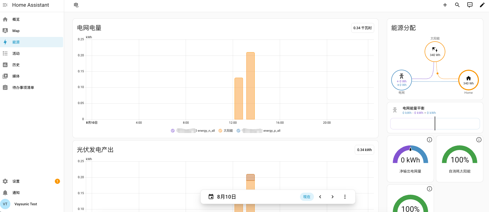
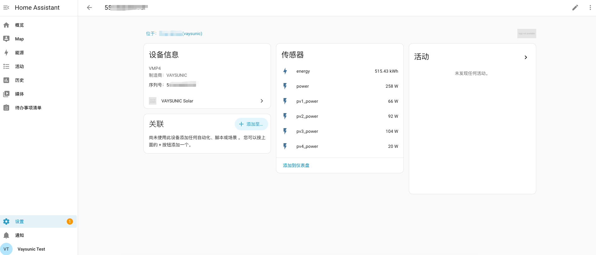
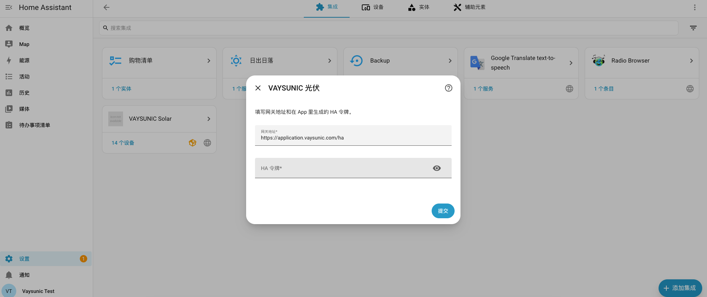

# VAYSUNIC Solar — Home Assistant 集成

[![HACS: Custom][hacs-badge]][hacs]
[![Release][release-badge]][releases]
![HA 最低版本][ha-badge]
![IoT class: cloud polling][iot-badge]

[English](README.md) | 简体中文

把你的 VAYSUNIC 光伏系统接进 Home Assistant —— 微逆、电表等设备都会变成原生实体，发电量和电网数据可以直接驱动 HA 自带的**能源面板**。



*每台微逆的发电量直接进 Home Assistant 自带的能源面板 —— 不用写模板传感器，不用配 YAML。*



*每台设备一个独立页面。设备上报的每个测点都会变成一个带正确单位与 device_class 的传感器。*

## 工作方式

本集成的 `iot_class` 是 **`cloud_polling`**，不是本地集成。Home Assistant 每 2 分钟轮询一次 VAYSUNIC 云端 API，**不直接与你的逆变器通信**。云端或你的网络中断时，HA 就取不到数据。

- **2 分钟轮询**，与设备实际上报节奏匹配。
- **不要账号密码。** 你填的是一个专用令牌。
- **随时可吊销。** 令牌一撤，HA 立刻取不到数据。
- **纯只读。** 集成改不了你系统上的任何设置。

## 前置条件

- Home Assistant **2024.1.0** 或更新版本
- 一个 VAYSUNIC 账号，且**名下有自有电站**
- 一个 **HA 令牌**，在 VAYSUNIC App 里生成

> **令牌等同密码**，拿到它的人能读走你名下全部电站的数据。

## 安装

### HACS（推荐）

1. HACS → 右上角三点菜单 → **自定义存储库**
2. 填入本仓库地址，类别选 **Integration**，添加
3. 在 HACS 里搜索 **VAYSUNIC Solar** 安装，然后**重启 Home Assistant**

### 手动安装

把 `custom_components/vaysunic` 整个目录拷进 Home Assistant 的 `config/custom_components/`，重启即可。

## 配置

**设置 → 设备与服务 → 添加集成 → VAYSUNIC Solar**



| 字段 | 填什么 |
| --- | --- |
| **网关地址** | `https://application.vaysunic.com/ha` —— 已经替你填好了 |
| **HA 令牌** | 你在 App 里生成的那串令牌 |

令牌当场校验，填错或已吊销会立刻报错。如果一个原本可用的令牌之后被吊销，HA 会弹出重新认证提示，换个新令牌即可，**历史数据不会丢**。

一个令牌对应一个配置条目，覆盖你名下**全部自有电站**，不能只接入其中某一个。别人分享给你的电站不在内。

## 配置能源面板

多数人装这个集成就是为了它。打开**设置 → 仪表板 → 能源**，按下表填：

| 能源面板槽位 | 选哪个实体 |
| --- | --- |
| **太阳能电池板** | **每一台**微逆的 `energy` —— 有几台加几个，HA 会自动求和 |
| **电网用电** | `energy_p_all`；单相表则是 `energy_p` |
| **返回电网** | `energy_n_all`；单相表则是 `energy_n` |

**我的表是哪一种？** 看它的实体列表：**有 `_all` 结尾的实体就是三相表**，选这一对准没错，它已经涵盖了三相。单相表没有任何 `_all` 实体。

> **每个槽位都能加多个实体，而 HA 只是把它们相加。** 所以加进同一个槽位的实体，必须计量**互不重叠**的电流 —— 同一批电算两遍，不只是发电量翻倍，家庭消耗和自发自用率会跟着一起错。

目前提供电量实体的是**微逆和电表**，其他设备类型只有功率等瞬时数据。因此纯微储、没配并网电表的系统，能源面板的「电网用电」和「返回电网」会是空的，装一块并网电表即可解决。

### 三相表的分相实体

三相表还会把每一相单独暴露出来：

| 相 | 电网用电 | 返回电网 |
| --- | --- | --- |
| A | `energy_p` | `energy_n` |
| B | `energy_p_pb` | `energy_n_pb` |
| C | `energy_p_pc` | `energy_n_pc` |

**绝大多数安装用 `_all` 那一对就行，这些可以不管。** 分相值只在一种情况下有意义：三相的用途并不相同 —— 比如其中某一相接的是发电设备而不是家庭负载，这时合计值就不再是纯粹的电网买卖电了。如果你的现场是这样，改成**按相各建一个「电网连接」**（每个连接配这一相的买电与馈电），而不要用 `_all` 那一对。

不确定自己属于哪种？问装这套系统的人。

> ⚠️ `_all` 那一对和分相**二选一，绝不能同时用**。混着选会重复计量同一批电，而且这个错会连带把家庭消耗、自发自用率一起算错。

## 会创建哪些实体

设备按序列号归组，所属区域取电站名。

每个数值测点对应一个 `sensor`，带 `device_class` / `state_class` / 单位。电量是**累计计数器**，标 `total_increasing`，今日 / 本周 / 本月这些由 HA 自己派生。

**每一路组串的功率、电压、电流都是独立实体**，哪一块组件出力不对一眼能看出来，不会被整机平均值掩盖。

实体 ID 由「电站 + 设备序列号 + 测点名」拼成 —— 电站叫 *My Plant*、序列号为 `A1B2C3D4E5F6` 的设备，其电量实体就是 `sensor.my_plant_a1b2c3d4e5f6_energy`。**序列号一定在里面**，所以每个实体都能唯一对应到一台设备。

目前可用的电量测点：

| 设备 | 测点 | 含义 |
| --- | --- | --- |
| 微逆 | `energy` | 该台微逆的累计发电量 |
| 单相表 | `energy_p` / `energy_n` | 从电网买电 / 上网馈电 |
| 三相表 | `energy_p_all` / `energy_n_all` | 买电 / 馈电，三相合计 |
| 三相表 | `energy_p_pb` / `energy_n_pb`、`energy_p_pc` / `energy_n_pc` | 同上，但拆到每一相 —— 见[三相表的分相实体](#三相表的分相实体) |

新增测点、新增设备会在后续轮询里自动发现，不用重装。设备在平台侧删除后，它的实体会停止更新，但 HA 不会自动删掉。

## 数据新鲜度

- HA 每 **2 分钟**轮询一次。设备约每 3 分钟上报一次，拉得更勤也只是反复取回同一份数据。
- 停止上报的设备会被判为离线，实体变成**不可用**。
- **微逆夜间会整夜不可用。** 天黑后停止上报，早上恢复。这是正常现象，**不会弄坏能源面板**：`total_increasing` 把不可用的间隔当作暂停而非计数器归零，况且夜里本来就不发电、没有增量可丢。电表 24 小时在线，买电/馈电数据不受影响。

## 隐私与数据

- 集成只从你的 Home Assistant 发起**出站** HTTPS 请求，没有任何入站连接，也不需要消息中间件。
- 从不索取账号密码，只用那个专用令牌。
- 接口纯只读，HA 这边改不了你系统的任何设置。
- 吊销令牌，数据立即中断；卸载集成，不再发出任何流量。

## 排障

在 `configuration.yaml` 里打开调试日志后重启：

```yaml
logger:
  logs:
    custom_components.vaysunic: debug
```

| 现象 | 多半是什么原因 |
| --- | --- |
| 配置成功但一个实体都没有 | 你的设备当前全部离线。实体是从**第一次取到读数**的轮询开始创建的 —— 白天再看一次，或先在 App 里确认有设备在线 |
| 实体夜里显示"不可用" | 微逆的正常表现，见[数据新鲜度](#数据新鲜度) |
| 提示令牌无效或已吊销 | 令牌被撤销或填错了。HA 会弹出重新认证，换新令牌即可 |
| 提示连接网关失败 | 网关地址填错，或 HA 上不了外网。对照上表核对地址 |
| 能源面板下拉框里找不到某个电量实体 | HA 只列出已经积累了统计数据的实体。新加的设备最长需要 2 小时才会出现 |
| 某个预期的测点没有 | 只下发设备实际上报的内容 |

## 参与贡献

问题反馈与需求：[提 issue][issues]。请附上 Home Assistant 版本、集成版本，以及上面那段调试日志。

## 开源许可

采用 [Apache License 2.0](LICENSE)。注意该许可**不授予** VAYSUNIC 名称与标识的使用权 —— 见第 6 条。

[hacs]: https://github.com/hacs/integration
[hacs-badge]: https://img.shields.io/badge/HACS-Custom-41BDF5.svg
[release-badge]: https://img.shields.io/github/v/release/vaysunic-com/ha-integration
[releases]: https://github.com/vaysunic-com/ha-integration/releases
[ha-badge]: https://img.shields.io/badge/Home%20Assistant-2024.1.0%2B-41BDF5.svg
[iot-badge]: https://img.shields.io/badge/IoT%20class-cloud%20polling-orange.svg
[issues]: https://github.com/vaysunic-com/ha-integration/issues
